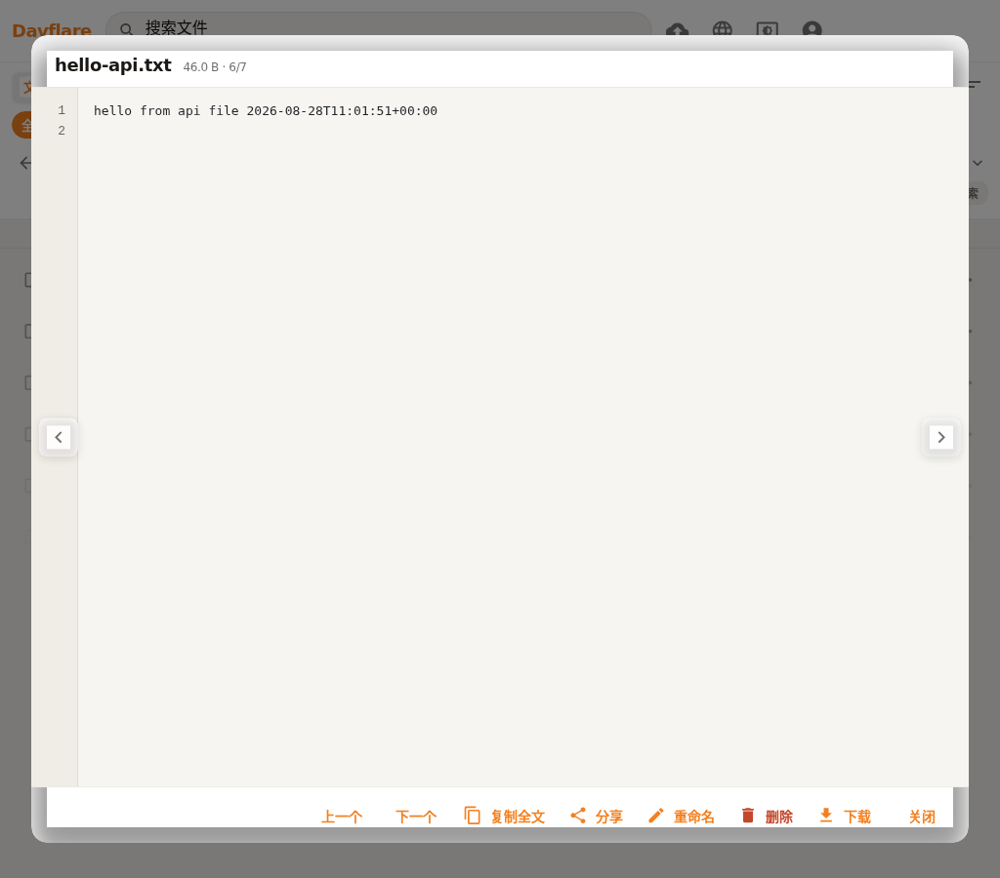
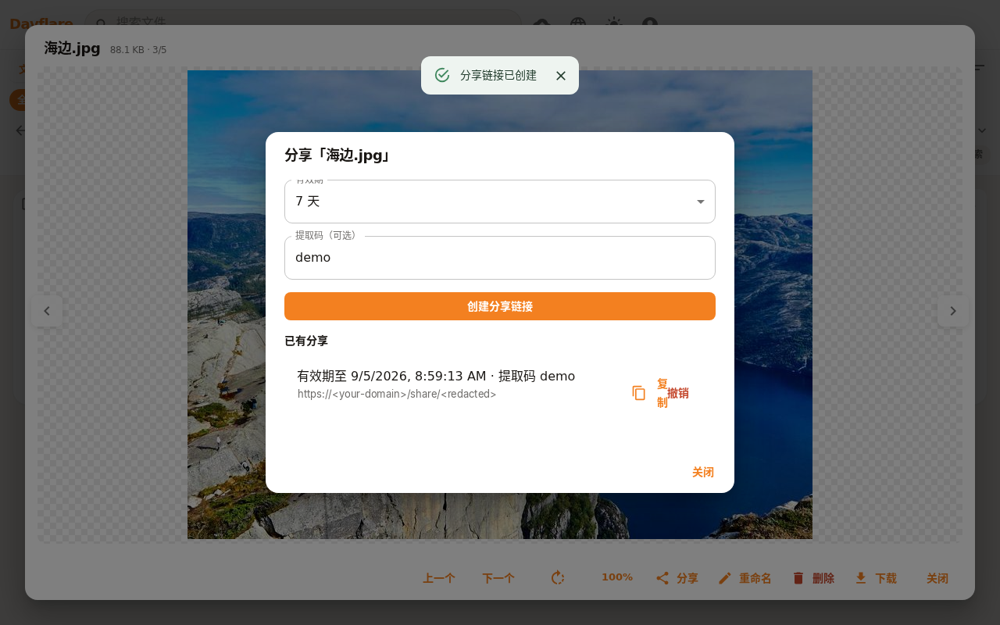

# Davflare

[English](README.md) | [中文](README.zh-CN.md)

[](https://deploy.workers.cloudflare.com/?url=https://github.com/fanchenggang/Davflare)

基于 Cloudflare Pages + Workers 的 R2 网盘 —— 免费 10 GB 存储、每天 10 万次 Worker 调用。[R2 定价](https://developers.cloudflare.com/r2/platform/pricing/)

## 截图

网格浅色：


网格深色：


图片预览：



分享（有效期 + 提取码）：



## 功能

- 网页端分片上传大文件
- 文件夹、搜索、拖放，以及图片 / 视频 / PDF 缩略图
- 分享链接（限时或永久）、提取码、文件夹 zip 下载 —— 链接打开零脚本落地页（亮暗双套，含文件名/类型/大小/分享时间与在线预览）；`?download=1` 直链下载，`?raw=1` 内联内容
- 回收站，由 `TRASH_RETENTION_DAYS` 控制（默认 30 天；`-1` 关闭；打开回收站时惰性清理最多 200 项）
- WebDAV Class 1/2，路径 `/webdav`（可关闭，不影响网页端文件管理）
- API Key，可用于脚本上传、下载与双向同步
- 远程 MCP，路径 `/mcp`（21 个工具：文件、搜索、移动/复制、分享、站点、`pull` / `push` / `publish_site`，以及 `image_upload` / `image_list` / `image_delete`）。上传超过 1 MiB 自动分块，上限 25 MB；下载用 `part` 分页。**MCP 依赖 API Key**：若 API Key 开关关闭，即使 MCP 开关打开，`/mcp` 也是 404
- 网页端站点管理（`#/sites`）：zip 一键部署、SPA 开关、按站删除
- 静态站点走单独域名（`SITES_HOST` + `sites/{slug}/`）；[docs/sites.zh-CN.md](docs/sites.zh-CN.md)
- 图床走同一站点域名的 `/i/{id}`（对象存在 `_$flaredrive$/img/`，不与 `sites/` 或分享链接混用）
- 拥有者设置页（`#/settings`）五个功能开关（默认全部开启，持久化到 R2）
- `davflare-cli`：login / ls / mkdir / rm / mv / cp / sync（[cli/README.md](cli/README.md)）
- 可选 Chrome MV3 扩展（`extension/`）：工具栏打开**你自己的**实例；不改 Chrome 新标签页
- Agent 目录约定：`agents/{global|agent|agent/project}/{skills|rules|mcp}/`（`pull` / `push` 工具，见 [docs/agents.zh-CN.md](docs/agents.zh-CN.md)）；可复现示例见 [`agents/examples/hello-site/`](agents/examples/hello-site/)
- 中 / 英界面（标题栏地球图标；默认跟随浏览器语言，并保存在本地）

## 用 Cursor 试一把（复制即用）

1. `#/settings` 保持 **API Key**、**MCP**、**静态站点** 打开，创建一把密钥。
2. 粘贴到 Cursor 的 `mcp.json`（换成你的域名和密钥）：

```json
{
  "mcpServers": {
    "davflare": {
      "url": "https://<your-domain.com>/mcp",
      "headers": { "Authorization": "Bearer <apiKey>" }
    }
  }
}
```

3. 打开本仓库 [`agents/examples/hello-site/`](agents/examples/hello-site/)，让 Cursor 按 `SKILL.md` 做（只用现有 `publish_site`，可选 `image_upload`）。
4. 跑完得到 **`https://sites.<你的域>/hello/`**（你真实的 `SITES_HOST`）。没有别人能打开的公共演示站。

## 跟着做

三条短路径。请用**你自己绑定的域名**——没有别人能打开的公开演示站。

### 用 Cursor 对话发布静态站

1. 按 [用 Cursor 试一把](#用-cursor-试一把复制即用) 配好 MCP，并绑定 Pages 环境变量 `SITES_HOST` 后重新部署。
2. 对 Cursor 说（可直接粘贴），上下文带上 `agents/examples/hello-site/`：

   ```
   按 agents/examples/hello-site/SKILL.md 做：上传 index.html，再 publish_site slug=hello。完成标准：https://<SITES_HOST>/hello/ 返回 200。
   ```

3. 在你绑到**本** Pages 项目的主机上打开 `https://<SITES_HOST>/hello/`。未设置 `SITES_HOST` 并重新部署之前，这个地址打不开。

### 图床拖放并复制链接

1. 打开网盘里的 `#/images`。
2. 把图片拖到页面上（或点上传）。
3. 点 **复制链接** 或 **复制 Markdown**（``）。公开地址只有在绑定自定义域并设置 Pages 环境变量 `SITES_HOST`（只要主机名）之后才可用。

### 设置里的五个开关

1. 从账号菜单打开 `#/settings`。
2. 五个开关是 WebDAV、MCP、API Key、静态站点、图床（默认全部开启）。关闭开关不会删除已有文件。
3. MCP 依赖 API Key：Key 关闭时，即使 MCP 打开，`/mcp` 也是 404。站点和图床的公开地址还需要 `SITES_HOST`。

### 用 rclone 挂 WebDAV（可选）

1. `rclone config` → New remote → 类型 `webdav` → URL `https://<your-domain.com>/webdav` → vendor `other` → 用户名/密码 = Pages 里的 `WEBDAV_USERNAME` / `WEBDAV_PASSWORD`。
2. `#/settings` 里保持 WebDAV 开关打开。
3. `rclone ls davflare:`（远程名随你）应能列出网盘根目录。

## 部署

一键部署：

[](https://deploy.workers.cloudflare.com/?url=https://github.com/fanchenggang/Davflare)

你需要一个已绑定支付方式、并已开通 R2 的 [Cloudflare](https://dash.cloudflare.com/) 账号（至少创建一个 bucket）。

首次部署之后：

1. 将 R2 bucket 绑定到 `BUCKET` 变量
2. 设置 `WEBDAV_USERNAME` 和 `WEBDAV_PASSWORD`
3. 可选：`WEBDAV_PUBLIC_READ=1` 开启公开读取；`TRASH_RETENTION_DAYS`（默认 `30`，`-1` 关闭清理）
4. 可选静态站点：把 `sites.<你的域>` 绑到同一个 Pages 项目，并设置 `SITES_HOST=sites.<你的域>`
5. 重新部署，使绑定和环境变量生效
6. 可选：给网盘界面绑自定义域名

### 手动部署 Cloudflare Pages

- 框架预设：**None（React/Vite，不是 Docusaurus）**
- 输出目录：`build`
- 然后绑定 `BUCKET`、设置上述环境变量，并重新部署

### Wrangler CLI

`wrangler.toml` 将 R2 绑定为 `BUCKET`（默认 bucket 名为 `webdav`）。如有需要，把 `bucket_name` 改成你的 bucket。

```bash
npm run build
npx wrangler pages deploy build
```

## WebDAV

地址：`https://<your-domain.com>/webdav`

可用任意 WebDAV 客户端（例如 [Cx File Explorer](https://play.google.com/store/apps/details?id=com.cxinventor.file.explorer) 或 [BD File Manager](https://play.google.com/store/apps/details?id=com.liuzho.file.explorer)）。填入上述地址以及你设置的用户名和密码。

Cloudflare Workers 单次 PUT 上限为 **128 MB**。超限会返回 **HTTP 413**（提示使用网页上传）。大文件请走网页端分片上传。

应用内 WebDAV 面板会显示 URL、用户名，以及是否开启公开读取。**不会**显示密码。

## 开放接口

在网页端「API」 / 「开放接口」创建密钥。鉴权：`Authorization: Bearer <apiKey>` 或 `X-Api-Key: <apiKey>`。完整请求示例见 [开放接口文档](docs/API.zh-CN.md)。

| 方法 | 路径 | 作用 |
| --- | --- | --- |
| GET / PATCH | `/api/config` | 会话：用户名、公开读取、sitesHost、功能开关。PATCH 仅 Basic |
| GET / POST / DELETE | `/api/images` | 图床（会话或 API Key）：列出、上传、删除。公开字节在 `SITES_HOST /i/{id}` |
| GET / POST / DELETE | `/api/keys` | 创建、列出、作废密钥（需网页登录会话） |
| POST / PUT / DELETE | `/api/upload` | 上传文件（multipart / 原始 body / 覆盖 / >100MB 分片） |
| GET | `/api/list` | 列出当前目录（size、uploaded、etag） |
| GET | `/api/download` | 下载单个文件（Range / 206 断点续传） |
| POST | `/api/mkdir` | 创建文件夹（自动补齐父目录） |
| POST | `/api/rename` | 重命名 / 移动文件或文件夹 |
| POST | `/api/copy` | 复制文件 |
| GET | `/api/stat` | 对象元数据 |
| GET | `/api/search` | 按文件名子串搜索 |
| POST | `/api/backup` | 冲突时把远端改名为 `name.conflict-<UTC>` |
| DELETE | `/api/delete` | 硬删除，或 `soft=1` 进回收站 |
| POST | `/api/shares` | 分享文件或文件夹（文件夹为 zip） |
| GET / POST / DELETE | `/api/sites` | 列出、配置 SPA、删除静态站 |
| POST | `/mcp` | 远程 MCP（JSON-RPC 2.0；同一把 API 密钥；21 个工具） |

同一把密钥可做双向同步（本地优先，冲突时先备份远端）。详见 [开放接口文档](docs/API.zh-CN.md)。

**分享链接**（`/share/<token>`）默认返回服务端渲染、零脚本的落地页：文件名、类型、大小、分享时间，图片/音视频/PDF/文本还带在线预览（`` / `<video>` / `<audio>` / `<iframe>`）；语言跟随 `Accept-Language`。以前直接抓分享链接原始字节的脚本需要改用：**`?download=1` 返回附件下载直链**（文件夹仍为 zip 流），**`?raw=1` 返回内联内容**（图片/音视频/PDF/文本等可预览类型），安全响应头（`Content-Security-Policy: sandbox`、`X-Content-Type-Options: nosniff`）与 Range 支持保持不变。过期返回 **410**、撤销返回 **404**，提取码门禁对落地页与两个参数同样生效。

`GET /api/config`（网页会话）返回用户名、公开读取、`sitesHost` 以及五个功能开关。`PATCH /api/config` 更新开关，**仅允许网页会话（Basic）**，API Key 不能改开关。

## 功能开关

拥有者在设置页（`#/settings`，账号菜单）开关五项能力。配置存在 R2 的 `_$flaredrive$/config.json`，部署后仍保留，**不要**写进 `wrangler.toml`。默认全部**开启**。

| 开关 | 关闭后 |
| --- | --- |
| WebDAV | 隐藏 WebDAV 按钮/面板。客户端无法挂载 `/webdav`（404）。网页端文件管理仍走会话接口。 |
| MCP | `POST /mcp` → 404；隐藏 API 面板里的 MCP 说明。 |
| API Key | 隐藏密钥管理。Bearer / `X-Api-Key` 开放接口返回 401。网页会话接口不受影响。**MCP 也会 404/不可用**（因为它用 API Key 鉴权）。 |
| 静态站点 | 隐藏 `#/sites`。`SITES_HOST` 上的 slug 站点 404。不会删除 `sites/` 下的对象。 |
| 图床 | 隐藏图床界面。`SITES_HOST` 上的 `/i/*` 404。不会删除已存图片。 |

`SITES_HOST` 为空时，基础设施层仍不对外提供站点/图床。绑定主机后，站点与图床开关是额外的产品开关。

## MCP

同源 Model Context Protocol（Streamable HTTP），路径 `POST /mcp`。鉴权与开放接口相同（`Authorization: Bearer <apiKey>` 或 `X-Api-Key`）。**MCP 依赖 API Key：API Key 开关关闭后，即使 MCP 开关仍打开也无法使用。**

工具（21 个）：`list`、`upload`、`download`、`mkdir`、`delete`、`search`、`move`、`copy`、`stat`、`share_create`、`share_list`、`share_revoke`、`sites_list`、`sites_config`、`sites_delete`、`pull`、`push`、`publish_site`、`image_upload`、`image_list`、`image_delete`。

不超过 1 MiB 的上传走内联；更大内容自动分块（上限 **25 MB**）。再大请用网页端或 `davflare-cli`。下载超过 1 MiB 用 `part` / `partSize` 分页。`delete` 默认进回收站，`hard=true` 永久删除。把文件上传到 `sites/{slug}/`（或用 `publish_site` 从网盘目录同步）即发布静态站，需要 SPA 回退再调 `sites_config`。`pull` / `push` 走 `agents/…`（合并：project 覆盖 agent 覆盖 global）。详见 [docs/API.zh-CN.md](docs/API.zh-CN.md)。

Cursor（`mcp.json`）：

```json
{
  "mcpServers": {
    "davflare": {
      "url": "https://<your-domain.com>/mcp",
      "headers": {
        "Authorization": "Bearer <apiKey>"
      }
    }
  }
}
```

## 静态站点

`sites/{slug}/` 下的 HTML 只在**单独域名**（`SITES_HOST`）上提供。同一个 Worker，按 Host 分流，不是网盘源上的 `/sites`。

网页端「站点」（`#/sites`）可看每个 slug 的统计、zip 一键部署、SPA 开关和删除。MCP 的 `sites_list` / `sites_config` / `sites_delete` 包装同一套 `/api/sites`。详见 [docs/sites.zh-CN.md](docs/sites.zh-CN.md)。

## 命令行

[`davflare-cli`](cli/README.md) 是开放接口的命令行客户端：`login`、`ls`、`mkdir`、`rm`、`mv`、`cp`、`sync`。超过 100 MB 自动分块上传，下载支持 HTTP Range 断点续传。安装与同步语义见 `cli/README.md`。

## 扩展

Chrome Manifest V3 辅助扩展，双模式工具栏：打开**你自己部署的** Davflare 网盘，或打开由实例 WebDAV 支撑的书签库。不在 Chrome 网上应用店上架。

- **设置内嵌在主页**：没有独立选项页。首次打开扩展页会直接进入设置视图——填实例地址（Pages / 自定义域名，默认空白，没有内置站点）、书签目录、WebDAV 凭据，保存并授权后自动进入网盘/书签视图（HamHome 式：先配置后使用）；侧栏「设置」随时可改。
- **工具栏双模式**：两种模式都打开扩展自己的页面——*网盘*（默认）**直接挂载 Web 端 React 组件**渲染文件管理器（不再 iframe 嵌实例网页，服务端的 `X-Frame-Options: DENY` 不再有影响），*书签* 打开书签库视图。在设置里选默认，随时右键工具栏图标切换；未配置实例时，工具栏点击直接打开设置视图。首次进入网盘视图会请求实例域名的 host 权限（`/api/*` 没有 CORS 头，必须授权后才能用搜索/回收站等能力；`/webdav` 本就开放 CORS）；「新标签页打开」按钮保留作兜底。
- 页面右键菜单有「收藏此页」——把当前标签页的标题 + URL 合并进你 WebDAV 上的书签文件。
- WebDAV 凭据（与部署时的 `WEBDAV_USERNAME` / `WEBDAV_PASSWORD` 一致）**仅**保存在 `chrome.storage.local`，不会同步到 Google 账号。保存实例地址时会按需申请该站点的 host 权限（可选权限，不预授权任何域名）。
- **不改 Chrome 新标签页。** 旧版曾提供带 newtab 覆盖的第二个 zip；由于 Chrome 的 `chrome_url_overrides` 只能在 manifest 里静态声明、装上即永久接管、无运行时开关，该变体已移除，现在只发一个包。

GitHub Release 附一个 zip：`davflare-extension.zip`（工具栏 + 内嵌设置 + 书签库 + 网盘视图）。

**加载未打包扩展：** Chrome → `chrome://extensions` → 开发者模式 → 加载已解压的扩展程序 → 选本仓库的 `extension/` 目录。注意：网盘视图是 vite 构建产物，源码目录加载前先在仓库根目录执行 `npm ci && npm run build:extension`（未构建时书签等功能照常，网盘视图会显示构建提示；Release zip 已含产物）。

**Release zip：** 从 [GitHub Releases](https://github.com/fanchenggang/Davflare/releases) 下载后解压再按上面的方式加载。打 tag（`v*` / `extension-*`）或在 **Actions → Release extension** 里运行工作流会附上 zip。

## 薄书签（P2）

扩展的书签库把书签存在**你自己的 WebDAV 上**——不依赖第三方服务，不含任何 AI。要求实例的 WebDAV 功能开关已打开。

- **存储布局**（实例 `/webdav/` 下，目录可在主页「设置」视图配置——默认 `bookmarks/`，例如填 `qa/bookmarks` 隔离测试数据）：`bookmarks.html` 是权威的 Netscape 书签文件，可直接用 Chrome/Edge「导入书签」；`bookmarks.json` 是旁路文件，承载 HTML 格式放不下的标签与备注；`workspaces.json`、`tabGroups.json`、`snapshots.json` 分别对应下面几个功能。写入带 `If-Match`，出现 412 冲突会明确提示重试，绝不静默覆盖。
- **书签库页**：侧栏分类/标签计数；搜索覆盖标题/URL/标签/备注，**支持拼音**（全拼与首字母，内置精简字典）；时间范围筛选；网格/列表视图；明暗主题；从 Chrome 书签导入（可选 `bookmarks` 权限，按 URL 合并）与导出 `bookmarks.html`。
- **HamHome 迁移（只读导入）**：书签库页可从同实例的 [HamHome](https://github.com/bingoYB/ham_home) 同步目录导入——读取 `/HamHomeSync/bookmarks/meta.json` + `categories.json`，按 URL 去重合并；描述转为备注、标签与分类目录保留、已删除行跳过。边界：我们自己的写入仍是自有格式；HamHome 的快照/工作区/Tab 规则（存其 IndexedDB 或应用内部 JSON）不迁移。
- **工作区**：把当前窗口存为工作区——页面顺序、固定状态、原生标签组元数据——之后可全部或勾选恢复到新窗口（URL 去重，还原固定与分组）。
- **Tab 分组**：本地规则引擎（域名后缀 / URL / 标题 / 正则，多条件 AND），一键把当前窗口收进原生标签组，可自定义标题/颜色/折叠/优先级；未命中可按根域名兜底。规则经 `tabGroups.json` 同步。
- **快照**：把页面捕获为单文件 HTML（CORS 允许的图片尽力内联；剥离 script/iframe；8 MB 上限）存到 `bookmarks/snapshots/`，在书签编辑里查看、下载、更新、删除。无 CORS 头的跨域资源无法内联（浏览器安全限制），`chrome://` 等受限页无法捕获。
- **错误不静默**：WebDAV 开关关闭（404）、服务端未配置凭据（403）、凭据错误（401）、编辑冲突（412）各有独立文案，并提供打开设置的入口。

## 图床

在网盘界面（`#/images`）拖放上传图片，复制公开 URL 或 Markdown ``，列出并删除。对象存在 `_$flaredrive$/img/{id}`，`{id}` 为不可猜测的随机值，不是原文件名。公开地址仅为 `https://<SITES_HOST>/i/{id}`（`SITES_HOST` 不含协议）。SVG 以附件下发（`Content-Disposition: attachment` + `nosniff`），不会当成可执行页面打开。

站点域名上先匹配 `/i/{id}`，再走 slug 静态站。图床开关与站点开关独立：站点关、图床开 → slug 404 但 `/i/{id}` 可用；图床关 → 即使站点开，`/i/*` 也是 404。未配置 `SITES_HOST` 时开关仍在，界面会提示先绑定该域名。

## Agent 目录

skills / rules / MCP 片段放在 R2 的 `agents/` 下。仓库示例：[`agents/examples/hello-site/`](agents/examples/hello-site/)。v2 的 `pull` / `push` 会走这棵树（也可用网页端）。合并顺序：project 覆盖 agent 覆盖 global。`mcp.json` 里不要存明文密钥，用 `${env:DAVFLARE_API_KEY}`。Cursor 落地路径见 [docs/agents.zh-CN.md](docs/agents.zh-CN.md)。

## 开发与测试

```bash
npm install

npm run typecheck   # tsc --noEmit (covers src/ and functions/)
npm test            # Vitest 单测（单次运行）
npm run test:ci     # 同一套件（保留脚本名以兼容 CI 文档）
npm run test:coverage   # Vitest + v8 覆盖率（含阈值校验）
npm run build       # typecheck + 生产构建到 build/

npm run test:e2e    # one-shot API regression: build → wrangler pages dev (local miniflare R2) → scripts/api-e2e.sh
SKIP_BUILD=1 npm run test:e2e   # reuse an existing build/ for faster iterations
```

`test:e2e` 会在缺少时创建本地 `.dev.vars`（已 gitignore）写入开发凭据，在 8788 端口启动 `wrangler pages dev`（可用 `PORT` 覆盖），等待就绪后跑约 170 条断言，再关掉服务。数据在 `.wrangler/state/` —— 删除该目录即可重置本地 bucket。完整验证记录见 [TESTING.md](./TESTING.md)，手工 GUI 用例库见 [TEST_CASES.md](./TEST_CASES.md)。

## 致谢

- [longern/FlareDrive](https://github.com/longern/FlareDrive) by [longern](https://github.com/longern) —— 最初的 fork 来源；本项目此后已全面重写。内部对象前缀仍为 `_$flaredrive$/`。
- [r2-webdav](https://github.com/abersheeran/r2-webdav) by [abersheeran](https://github.com/abersheeran) —— WebDAV 实现。

## 许可证

[MIT](./LICENSE)
