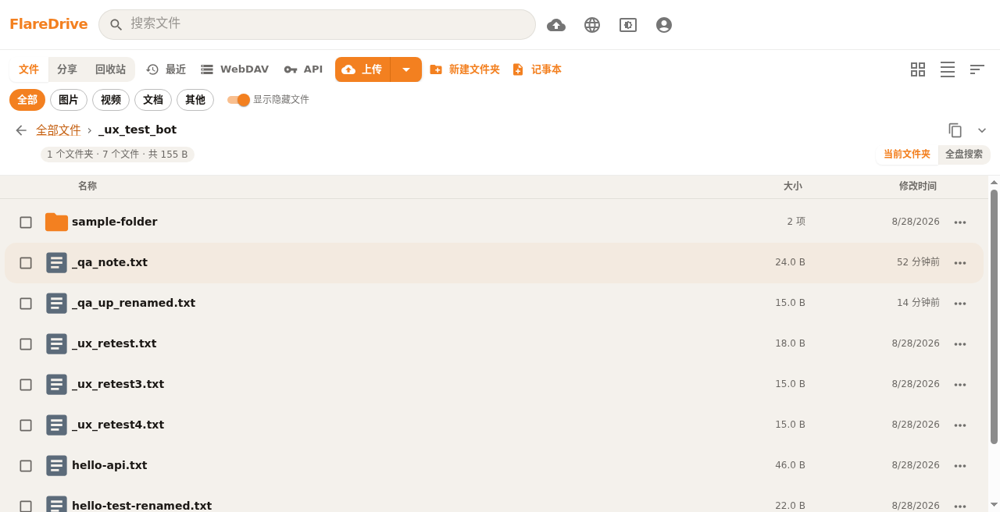

# Davflare

[English](README.md) | [中文](README.zh-CN.md)

[](https://deploy.workers.cloudflare.com/?url=https://github.com/fanchenggang/FlareDrive)

基于 Cloudflare Pages + Workers 的 R2 网盘 —— 免费 10 GB 存储、每天 10 万次 Worker 调用。[R2 定价](https://developers.cloudflare.com/r2/platform/pricing/)

本项目最初 fork 自 [longern/FlareDrive](https://github.com/longern/FlareDrive)，现已全面重写。GitHub 仓库名目前仍为 **FlareDrive**，以便 Pages 与 CI 继续正常工作。

## 截图

文件浏览器（浅色主题）：



预览 / 分享：


## 功能

- 网页端分片上传大文件
- 文件夹、搜索、拖放，以及图片 / 视频 / PDF 缩略图
- 分享链接（限时或永久）、提取码、文件夹 zip 下载
- 回收站，由 `TRASH_RETENTION_DAYS` 控制（默认 30 天；`-1` 关闭；打开回收站时惰性清理最多 200 项）
- WebDAV Class 1/2，路径 `/webdav`
- API Key，可用于脚本上传、下载与双向同步
- 中 / 英界面（标题栏地球图标；默认跟随浏览器语言，并保存在本地）

## 部署

一键部署：

[](https://deploy.workers.cloudflare.com/?url=https://github.com/fanchenggang/FlareDrive)

你需要一个已绑定支付方式、并已开通 R2 的 [Cloudflare](https://dash.cloudflare.com/) 账号（至少创建一个 bucket）。

首次部署之后：

1. 将 R2 bucket 绑定到 `BUCKET` 变量
2. 设置 `WEBDAV_USERNAME` 和 `WEBDAV_PASSWORD`
3. 可选：`WEBDAV_PUBLIC_READ=1` 开启公开读取；`TRASH_RETENTION_DAYS`（默认 `30`，`-1` 关闭清理）
4. 重新部署，使绑定和环境变量生效
5. 可选：绑定自定义域名

### 手动部署 Cloudflare Pages

- 框架预设：**None（React CRA，不是 Docusaurus）**
- 输出目录：`build`
- 然后绑定 `BUCKET`、设置上述环境变量，并重新部署

### Wrangler CLI

`wrangler.toml` 将 R2 绑定为 `BUCKET`（默认 bucket 名为 `webdav`）。如有需要，把 `bucket_name` 改成你的 bucket。

```bash
npm run build
npx wrangler pages deploy build
```

## WebDAV

地址：`https://<your-domain.com>/webdav`

可用任意 WebDAV 客户端（例如 [Cx File Explorer](https://play.google.com/store/apps/details?id=com.cxinventor.file.explorer) 或 [BD File Manager](https://play.google.com/store/apps/details?id=com.liuzho.file.explorer)）。填入上述地址以及你设置的用户名和密码。

Cloudflare Workers 单次 PUT 上限为 **128 MB**。超限会返回 **HTTP 413**（提示使用网页上传）。大文件请走网页端分片上传。

应用内 WebDAV 面板会显示 URL、用户名，以及是否开启公开读取。**不会**显示密码。

## 开放接口

在网页端「API」 / 「开放接口」创建密钥。鉴权：`Authorization: Bearer <apiKey>` 或 `X-Api-Key: <apiKey>`。完整请求示例见 [开放接口文档](docs/API.zh-CN.md)。

| 方法 | 路径 | 作用 |
| --- | --- | --- |
| GET / POST / DELETE | `/api/keys` | 创建、列出、作废密钥（需网页登录会话） |
| POST / PUT / DELETE | `/api/upload` | 上传文件（multipart / 原始 body / 覆盖 / >100MB 分片） |
| GET | `/api/list` | 列出当前目录（size、uploaded、etag） |
| GET | `/api/download` | 下载单个文件 |
| POST | `/api/mkdir` | 创建文件夹（自动补齐父目录） |
| POST | `/api/rename` | 重命名 / 移动文件或文件夹 |
| POST | `/api/backup` | 冲突时把远端改名为 `name.conflict-<UTC>` |
| DELETE | `/api/delete` | 硬删除，或 `soft=1` 进回收站 |
| POST | `/api/shares` | 分享文件或文件夹（文件夹为 zip） |

同一把密钥可做双向同步（本地优先，冲突时先备份远端）。详见 [开放接口文档](docs/API.zh-CN.md)。

## 开发与测试

```bash
npm install

npm run typecheck   # tsc --noEmit (covers src/ and functions/)
npm test            # Jest unit tests (interactive watch)
npm run test:ci     # Jest unit tests, single CI-friendly run
npm run build       # production build into build/

npm run test:e2e    # one-shot API regression: build → wrangler pages dev (local miniflare R2) → scripts/api-e2e.sh
SKIP_BUILD=1 npm run test:e2e   # reuse an existing build/ for faster iterations
```

`test:e2e` 会在缺少时创建本地 `.dev.vars`（已 gitignore）写入开发凭据，在 8788 端口启动 `wrangler pages dev`（可用 `PORT` 覆盖），等待就绪后跑约 79 条断言，再关掉服务。数据在 `.wrangler/state/` —— 删除该目录即可重置本地 bucket。完整验证记录见 [TESTING.md](./TESTING.md)，手工 GUI 用例库见 [TEST_CASES.md](./TEST_CASES.md)。

## 致谢

- [longern/FlareDrive](https://github.com/longern/FlareDrive) by [longern](https://github.com/longern) —— 最初的 fork 来源；本项目此后已全面重写。内部对象前缀仍为 `_$flaredrive$/`。
- [r2-webdav](https://github.com/abersheeran/r2-webdav) by [abersheeran](https://github.com/abersheeran) —— WebDAV 实现。

## 许可证

[MIT](./LICENSE)
