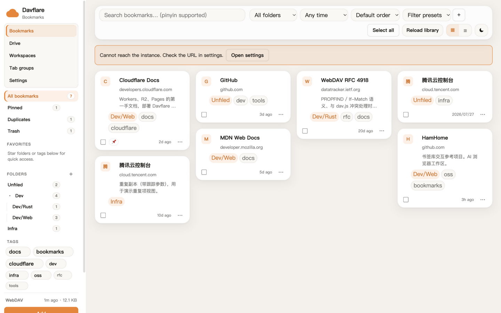
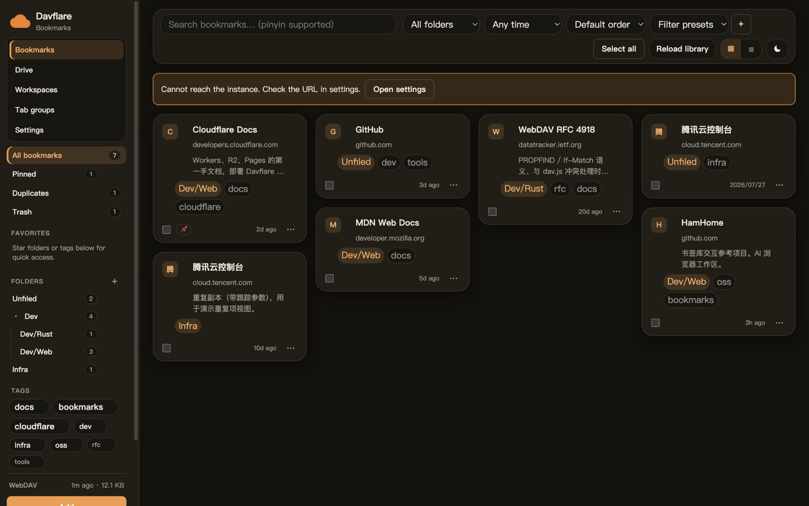

# Davflare Chrome 扩展

[English](README.md) | [中文](README.zh-CN.md)

← [README](../README.zh-CN.md)

Chrome Manifest V3 辅助扩展，双模式工具栏：打开**你自己部署的** Davflare 网盘，或打开由实例 WebDAV 支撑的书签库。不在 Chrome 网上应用店上架。

- **设置内嵌在主页**：没有独立选项页。首次打开扩展页会直接进入设置视图——填实例地址（Pages / 自定义域名，默认空白，没有内置站点）、书签目录、WebDAV 凭据，保存并授权后自动进入网盘/书签视图（HamHome 式：先配置后使用）；侧栏「设置」随时可改。
- **工具栏双模式**：两种模式都打开扩展自己的页面——*网盘*（默认）**直接挂载 Web 端 React 组件**渲染文件管理器（不再 iframe 嵌实例网页，服务端的 `X-Frame-Options: DENY` 不再有影响），*书签* 打开书签库视图。在设置里选默认，随时右键工具栏图标切换；未配置实例时，工具栏点击直接打开设置视图。首次进入网盘视图会请求实例域名的 host 权限（`/api/*` 没有 CORS 头，必须授权后才能用搜索/回收站等能力；`/webdav` 本就开放 CORS）；「新标签页打开」按钮保留作兜底。
- 页面右键菜单有「收藏此页」——把当前标签页的标题 + URL 合并进你 WebDAV 上的书签文件；链接右键「收藏链接到 Davflare」同样处理（标题取链接文字：借助右键点击授予的 `activeTab` + `scripting` 在所点的 frame 中读取，不需要额外站点权限；取不到时依次退回选中文字、URL）；`Alt+Shift+S` 可在任意页面唤起收藏弹窗（两个快捷键均可在 chrome://extensions/shortcuts 修改）。
- WebDAV 凭据（与部署时的 `WEBDAV_USERNAME` / `WEBDAV_PASSWORD` 一致）**仅**保存在 `chrome.storage.local`，不会同步到 Google 账号。保存实例地址时会按需申请该站点的 host 权限（可选权限，不预授权任何域名）。
- **不改 Chrome 新标签页。** 旧版曾提供带 newtab 覆盖的第二个 zip；由于 Chrome 的 `chrome_url_overrides` 只能在 manifest 里静态声明、装上即永久接管、无运行时开关，该变体已移除，现在只发一个包。

GitHub Release 附一个 zip：`davflare-extension.zip`（工具栏 + 内嵌设置 + 书签库 + 网盘视图）。

**加载未打包扩展：** Chrome → `chrome://extensions` → 开发者模式 → 加载已解压的扩展程序 → 选本仓库的 `extension/` 目录。注意：网盘视图是 vite 构建产物，源码目录加载前先在仓库根目录执行 `npm ci && npm run build:extension`（未构建时书签等功能照常，网盘视图会显示构建提示；Release zip 已含产物）。

**Release zip：** 从 [GitHub Releases](https://github.com/fanchenggang/Davflare/releases) 下载后解压再按上面的方式加载。打 tag（`v*` / `extension-*`）或在 **Actions → Release extension** 里运行工作流会附上 zip。

## 书签库截图（三轮视觉）

三轮视觉之后的书签库：ham_home 式紧凑卡片瀑布流、分类树侧栏、回收站与重复项视图，与收藏弹窗共用设计 tokens。

## 书签

扩展的书签库把书签存在**你自己的 WebDAV 上**——不依赖第三方服务，不含任何 AI。要求实例的 WebDAV 功能开关已打开。

- **存储布局**（实例 `/webdav/` 下，目录可在主页「设置」视图配置——默认 `bookmarks/`，例如填 `qa/bookmarks` 隔离测试数据）：`bookmarks.html` 是权威的 Netscape 书签文件，可直接用 Chrome/Edge「导入书签」；`bookmarks.json` 是旁路文件，承载 HTML 格式放不下的标签、备注与回收站标记；`workspaces.json`、`tabGroups.json`、`snapshots.json` 分别对应下面几个功能。写入带 `If-Match`，出现 412 冲突会明确提示重试，绝不静默覆盖。 写回浏览器书签时，目标文件夹中同一 URL 的重叠会弹出冲突对话框（跳过 / 更新标题 / 取消），也不会静默覆盖。
- **书签库页**：侧栏分类树（按 `/` 层级展开/折叠，父节点筛选含子文件夹）/标签云计数；搜索覆盖标题/URL/标签/备注，**支持拼音**（全拼与首字母，内置精简字典）；时间范围筛选；**瀑布流**网格/列表视图；卡片时间相对化（刚刚/N 分钟前/昨天）；明暗主题（切换带圆形扩散动画，`prefers-reduced-motion` 降级瞬切）；从 Chrome 书签导入（可选 `bookmarks` 权限，按 URL 合并）与导出 `bookmarks.html`。写回/导入会在用户手势内调用 `permissions.request`（先 confirm 预提示）；若系统授权框未出现（部分未打包 Chromium 局限），请到 `chrome://extensions` → Davflare → 详细信息 手动开启书签权限后重试。第四轮打磨：顶栏**吸顶** + 毛玻璃、列表行 hover 与卡片一致地浮起、空状态**按场景绘制**插画（书签库 / 搜索 / 回收站 / 重复项）、设置页展示已配置的键盘快捷键。
- **回收站（软删除）**：删除先进回收站（`deletedAt` 标记只写 JSON 旁路，HTML 权威文件保持干净），30 天后加载时自动清理；回收站视图支持恢复、彻底删除、清空；同 URL 重新收藏会自动从回收站复活。删除后的 6 秒撤销 toast 依然在，但数据安全不再依赖它。
- **重复项检测**：按去跟踪参数后的 URL 分组展示重复书签，可逐组选保留对象（默认最早一条）或一键「全部保留最早」；落选副本进回收站，可撤销。
- **页面内收藏面板（边缘面板）**：网页屏幕边缘的悬浮把手，点开即收——标题 / URL / 分类 / 标签 / 备注直接在页面内填写，走与弹窗相同的 WebDAV 管线（URL 在回收站中时与弹窗一致：预填原书签、收藏即恢复）。**按站点启用**：只授予该站点来源的可选 host 权限，面板以*动态*内容脚本注入，停用时注销注入、立即移除当前页面上的面板并撤销该站点授权——但**不会撤销你配置的 Davflare 服务器站点**（同步需要，弹窗会如实说明）；点一次「启用」并在 Chrome 授权框点「允许」即可（授权框会关闭弹窗，由后台通过 `permissions.onAdded` 完成启用）；已启用站点可 `Alt+Shift+P` 呼出/收起（升级安装或快捷键冲突时 Chrome 不会自动绑定，设置页和弹窗会显示「未设置」并提供打开 chrome://extensions/shortcuts 的按钮）；把手可停靠左/右（本机记忆）；深色跟随系统；Esc 关闭。未启用的站点不注入任何东西。
- **HamHome 迁移（只读导入）**：书签库页可从同实例的 [HamHome](https://github.com/bingoYB/ham_home) 同步目录导入——读取 `/HamHomeSync/bookmarks/meta.json` + `categories.json`，按 URL 去重合并；描述转为备注、标签与分类目录保留、已删除行跳过。边界：我们自己的写入仍是自有格式；HamHome 的快照/工作区/Tab 规则（存其 IndexedDB 或应用内部 JSON）不迁移。
- **工作区**：把当前窗口存为工作区——页面顺序、固定状态、原生标签组元数据——之后可全部或勾选恢复到新窗口（URL 去重，还原固定与分组）。
- **Tab 分组**：本地规则引擎（域名后缀 / URL / 标题 / 正则，多条件 AND），一键把当前窗口收进原生标签组，可自定义标题/颜色/折叠/优先级；未命中可按根域名兜底。规则经 `tabGroups.json` 同步。
- **快照**：把页面捕获为单文件 HTML（CORS 允许的图片尽力内联；剥离 script/iframe；8 MB 上限）存到 `bookmarks/snapshots/`，在书签编辑里查看、下载、更新、删除。无 CORS 头的跨域资源无法内联（浏览器安全限制），`chrome://` 等受限页无法捕获。首次捕获普通 `http(s)` 页时会按需申请该站点的 **host 权限**（`optional_host_permissions`，需在点击「生成快照」的用户手势内授权）；失败时会区分页面加载/注入失败与 WebDAV 写入失败。尚无 `snapshots.json` 时 GET 404 视为空索引（捕获时自动创建），不当成硬错误。
- **侧栏收藏夹**：把常用文件夹 / 标签 / 「置顶」视图钉到侧栏顶部，点 ★ 添加或移除（存在本机 `chrome.storage.sync`，不写 WebDAV）。
- **Omnibox**：地址栏输入 `df` + 空格后搜索缓存书签；无命中或选「在书签库中搜索」时打开库页并带上 `?q=` 筛选。
- **库占用可视**：设置页展示书签 HTML/JSON、工作区、Tab 规则、快照索引与 HTML 的估计体积（相对 `/webdav/<书签目录>/`）。
- **错误不静默**：WebDAV 开关关闭（404）、服务端未配置凭据（403）、凭据错误（401）、编辑冲突（412）各有独立文案，并提供打开设置的入口。

格式映射、HamHome 导入导出与冲突策略见 [docs/bookmarks-portability.zh-CN.md](../docs/bookmarks-portability.zh-CN.md)。

